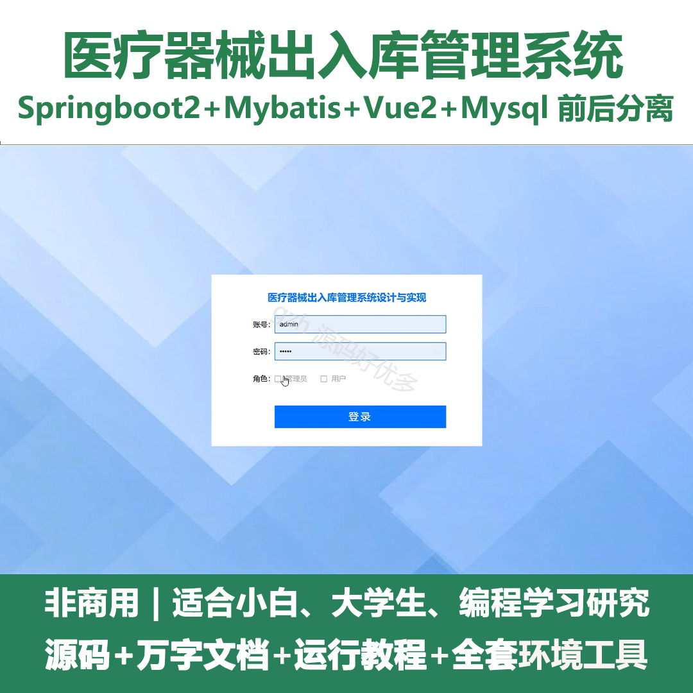
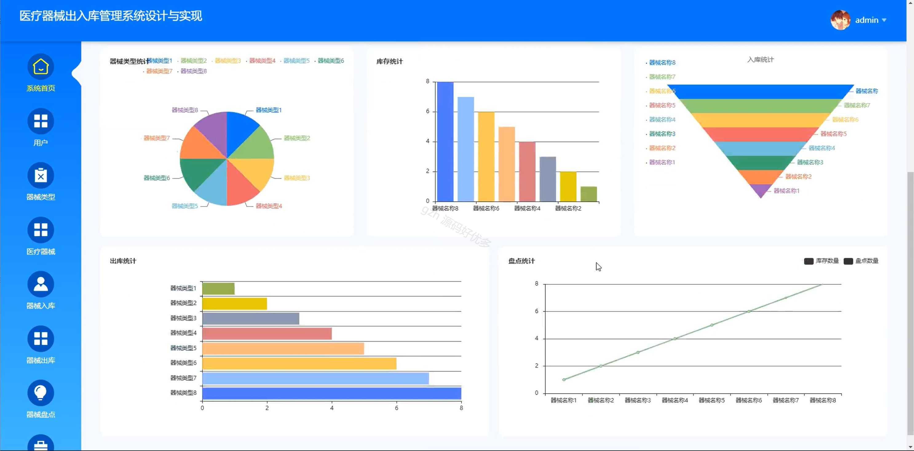
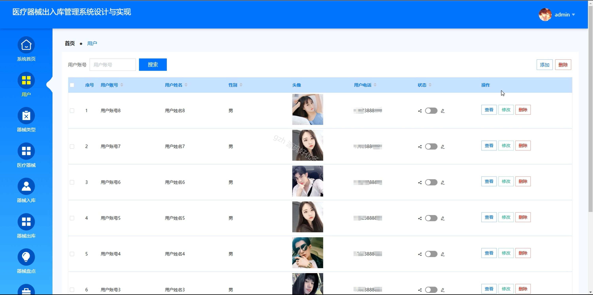
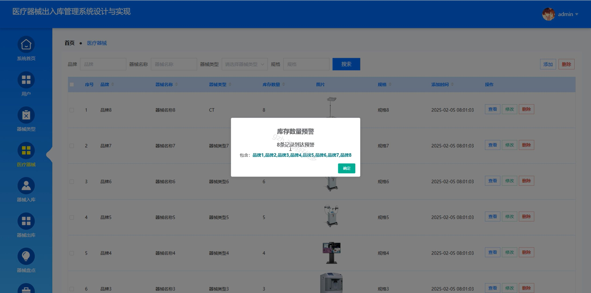
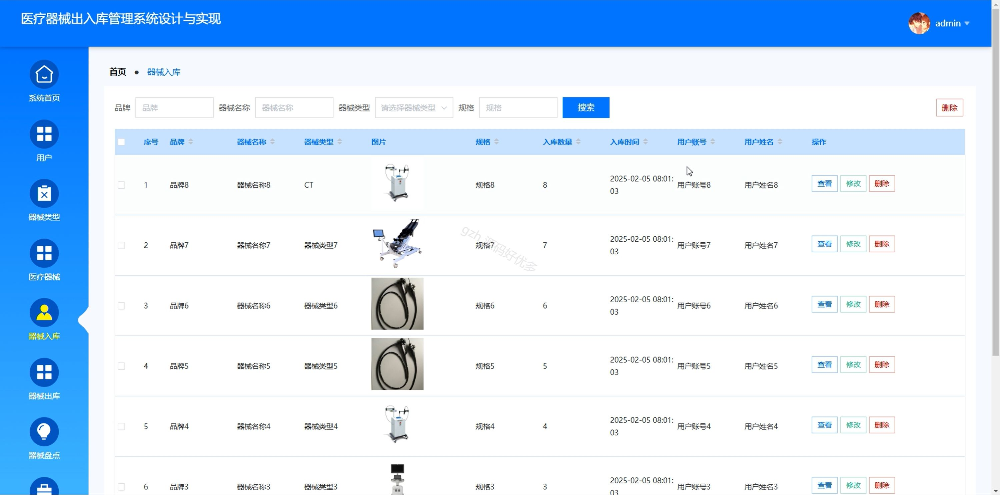
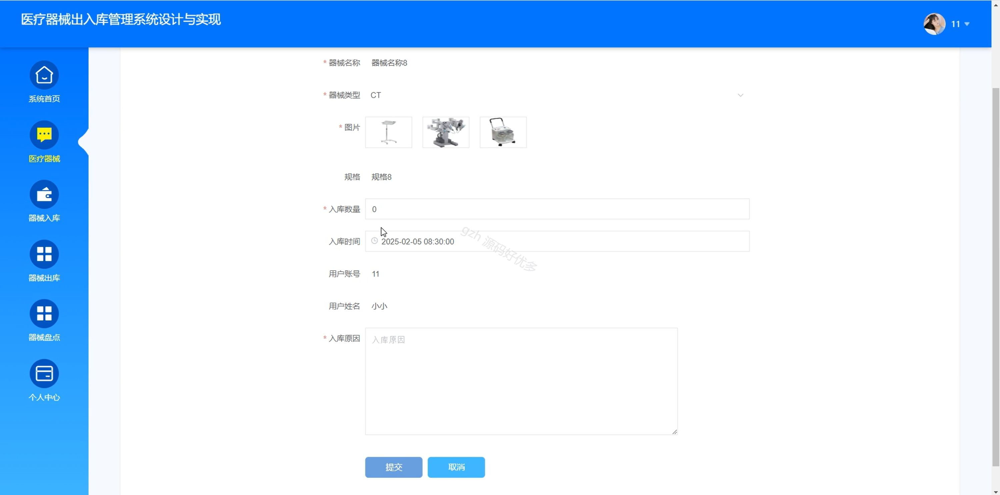
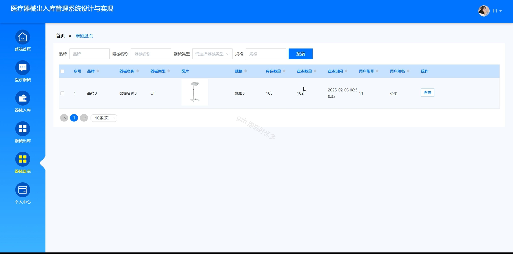
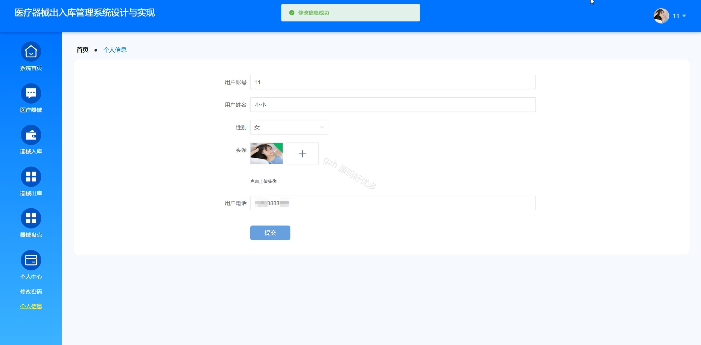
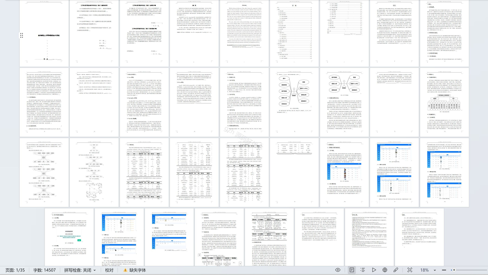

# springbootA145D
springbootA145D医疗器械出入库管理系统+LW
 
## 查看主页获取源码

### 一、关键词
医疗器械、器械入库、器械出库

### 二、作品包含
源码+数据库+设计文档万字+全套环境和工具资源+本地部署教程

### 三、项目技术
前端技术：Html、Css、Js、Vue2.0、Element-ui 
后端技术：Java、SpringBoot2.0、MyBatis

### 四、运行环境（以下版本亲测，其他版本未知，请自测）
开发工具：IDEA/eclipse  + VSCODE

数据库：MySQL5.7（最低要5.7版本）

数据库管理工具：Navicat10以上版本

环境配置软件： JDK1.8 + Maven3.6.3

前端Nodejs：14

浏览器：谷歌浏览器

### 五、项目介绍
项目编号：springbootA145D

医疗器械出入库管理系统能高效、精准地实现医疗器械入库、出库，保障医疗器械流转规范与安全。

角色：管理员、用户

用户功能：系统首页、医疗器械、器械入库、器械出库、器械盘点、个人中心。

管理员功能：系统首页、用户、器械类型、医疗器械、器械入库、器械出库、器械盘点、系统日志、个人中心。

### 六、运行截图

